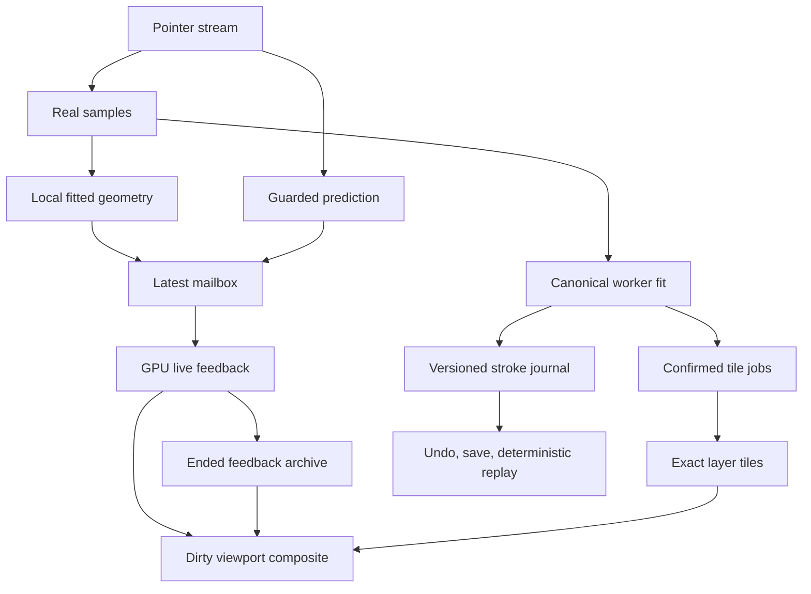

# Realtime brush architecture — v2.5 candidate

Production is not promoted. Software GPU gates and physical device gates are separate; see VALIDATION.md and measured failures.

| Option | Latency / wide tips | Complex brush quality | GPU / VRAM | Difficulty / compatibility / 4K / extension |
|---|---|---|---|---|
| A All GPU stamps | Removes CPU pixels, but overlapping footprints and FIFO can still accumulate | Good reference compatibility | High overdraw; tiles reduce storage | Moderate; two browser backends; large documents still need bounded work |
| B Continuous geometry + stamps | Solid union avoids input-frequency-dependent density | Texture, spray, decoration and dual tips retain stamps | Geometry clips to affected tiles; different accumulation formats | Higher implementation cost; WebGPU + WebGL2; sparse storage extends to4K |
| C Reduced-resolution feedback | Reduces live fill cost | AA/grain transitions need review | Smaller viewport surfaces; full-resolution final tiles | Useful capability, not a standalone solution or a passed visual gate |
| D Predicted tail + exact confirmed path | Covers short input/display delay; cannot solve a long GPU submission | Direction reversals need guard/expiry | Small mutable tail plus independent journal | Browser prediction optional; no proprietary algorithm assumed |

Chosen: B + D, persistent dirty viewport composition and bounded feedback state. The viewport is capped at1536px while document tiles remain full resolution. This is a candidate quality policy, not evidence that4K/4096px tips meet the physical latency gate.

## Input and canonical state

Select raw-update or pointer-move as the physical movement stream, never count both as separate motion. Preserve coalesced actual samples, timestamps, pressure, tilt, azimuth and twist. Browser predictions and the guarded12ms/16px fallback are transient. Real input stopping, lift and direction reversal remove prediction; it never enters the worker or saved journal. Predicted complex stamps obey the next spatial/time deposit; an empty cursor position is never reported as a drawn stamp tip. The diagnostic tracks deposited center/source time separately from newest actual input.

The local stabilizer fits a weighted linear model over at most8 points, adaptive past history24–48ms, evaluated at the newest actual timestamp. Constant velocity has no trailing-average phase delay. Its displacement is bounded; major corners reset the window. Pressure smoothing is independent. Constant and speed-dependent strength are evaluated from actual input; the `fast` setting is saved. This is an Illustro design informed by published feature behavior, not a reconstruction of ibis/CSP internals. Post-correction was evaluated but is not added as a second spatial-delay stage; end taper is finalized independently.

The canonical worker regenerates the same geometry and deterministic Philox commands, including distance/time exposure. A publication cursor scans only newly ready commands. The journal stores every accepted actual input, frozen preset, seed, smoothing/engine versions, geometry and commands. Record validation independently replays it. All56 preset configurations remain available. V1 records and earlier candidate engine versions are not silently interpreted as v2.5; explicit v2.4 replay preserves its original radius/AA semantics.

## Work scheduling and rendering

The latest mailbox has capacity one. New feedback replaces pending obsolete revisions; at most one GPU batch is outstanding. Already submitted GPU work cannot be cancelled by WebGPU/WebGL2. Each batch encodes live feedback before bounded confirmed chunks. This bounds outstanding submissions, not execution milliseconds on arbitrary hardware. GPU-completion age is never called presentation/photons.

Confirmed128px tiles process at most16 commands per ordinary chunk. Eligible solid capsules use instanced MAX coverage into RGBA16F; complex flow/pigment uses ordered RGBA32F accumulation. Final layer state is RGBA8 straight color with normal/multiply/screen/erase composition. Four-corner full-tile proofs permit exact no-op elision for constant-radius solid coverage; raw/canonical commands remain complete. The same proof suppresses later job construction. During active feedback, at most one ordinary confirmed chunk is allowed; if previous GPU work exceeds32ms it is deferred. On lift, the confirmed quantum starts at4 and adapts between1and8. This is cooperative scheduling before submission, without claiming preemption.

Eligible solid geometry requires dense spacing≤.25, hard round tips, constant pigment/opacity/flow and size-only mappings. Spaced dots keep ordered stamps. Live solid prefixes draw once per batch using a dedicated capsule shader and persistent opaque depth coverage. Large same-radius increments use conservative swept bands with16/32/64 sectors selected by a boundary-coverage proof; the exact capsule SDF supplies AA. Exact Float32 solid duplicates and fully covered tiles can be elided without discarding actual input. Their mutable/predicted tail is cleared separately. Complex presets with constant opacity/pigment accumulate normalized source-over density and apply stroke opacity at composition; varying flow/grain/masks remain supported. Variable opacity/pigment still uses an approximate live path, which is an open visual gate.

The viewport compositor persists. Only new prefix tiles, old/new tail tiles, changed confirmed tiles and retired feedback tiles are recomposed. A GPU viewport copy presents the cached surface; no CPU document clone, pixel walk or putImageData occurs in that path.

Ended feedback is folded into one GPU viewport surface in chronological groups of up to four editable prefix/tail pairs. Actual final tails are refreshed before archive; predicted-only regions do not acquire canonical archive tags. Per-tile real-stroke IDs let confirmed layers replace the archive without double deposition. Never-displayed completed strokes are retained in immediate feedback; only obsolete state notifications may be omitted. A transition can temporarily retain old/new GPU resources until completion; memory-pressure management remains open.

## Final images and integration

CPU Float64 loops run only as a final reference. Hard-ellipse AA intentionally uses a continuous signed-distance approximation in v2.2; dual tips retain their previous coverage. Hard single-star AA in v2.5 uses a continuous polar-boundary/gradient distance with algebraic GPU harmonics; the Float64 reference independently evaluates the corresponding trigonometric equation. This is an intentional AA change from v2.4, whose original kernel is retained for replay. Zero-alpha pixels normalize to zero RGBA. GPU numerical differences, intentional AA changes and bugs are recorded separately. PNG waits for confirmed tiles; Canvas2D image transfer is limited to export. Save, PNG, Undo/Redo and load first settle pending ended-worker records, then rebuild or read canonical tiles. Same-timestamp tilt/azimuth/twist changes remain actual input. A stationary pressure increase paints the union of the preceding and current solid radii immediately.

Build the package to import `@illustro/brush-rt`. It exports RealtimeSession, GpuRenderer, TileDocument, canonical/prediction/reference utilities and TypeScript declarations. The standalone page is the interactive harness. The existing Illustro core/layer/history adapter, memory spill and device-recreation lifecycle are still required; this candidate is not described as fully integrated production code.

## 表示通知と形状保持（最新方針）

[最上位の描画体験条件](EXPERIENCE_CONTRACT.md)を全ての性能・品質判定に優先する。stableSourceは追記専用の確定形状列、stableEndは通知作成時の固定終端。GPUはstableCursorからstableEndまでだけを読む。通知を置き換えても間の形状は失わない。可変末尾にも64形状の切り捨てを適用しない。正式描画待ちとは独立しているが、GPUに必要な全形状を処理できるかは別途遅延と描画中の画像で検査する。

## Executed candidate f20a028a

CPU computes rotation sine/cosine once per command into GPU-only packed slots12/15; canonical data is unchanged. Both shader languages read those coefficients. This changed the512px star reference error from9/255 to1/255 in CI37090457149. WebGPU pipelines are created asynchronously before drawing becomes ready, following the WebGPU specification, so pipeline compilation is not deliberately left for the first stroke. Full executed HTML blob: e4352a885c39e480f8972daaa1e8dda13c34e48e.
